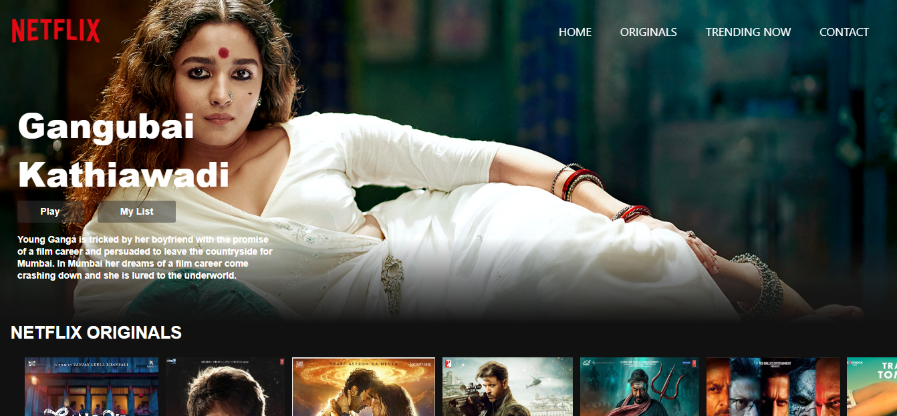
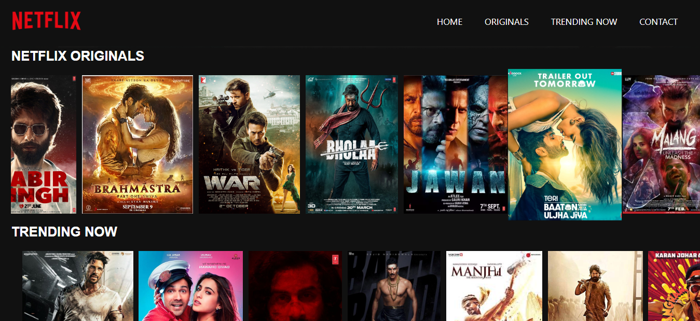

# NETFLIX

Creating a Netflix clone website with HTML and CSS involves designing a clean layout, implementing navigation, displaying content, adding search functionality, ensuring responsiveness, optionally integrating user authentication, and considering video playback. Aim for accuracy in replicating Netflix' project!
